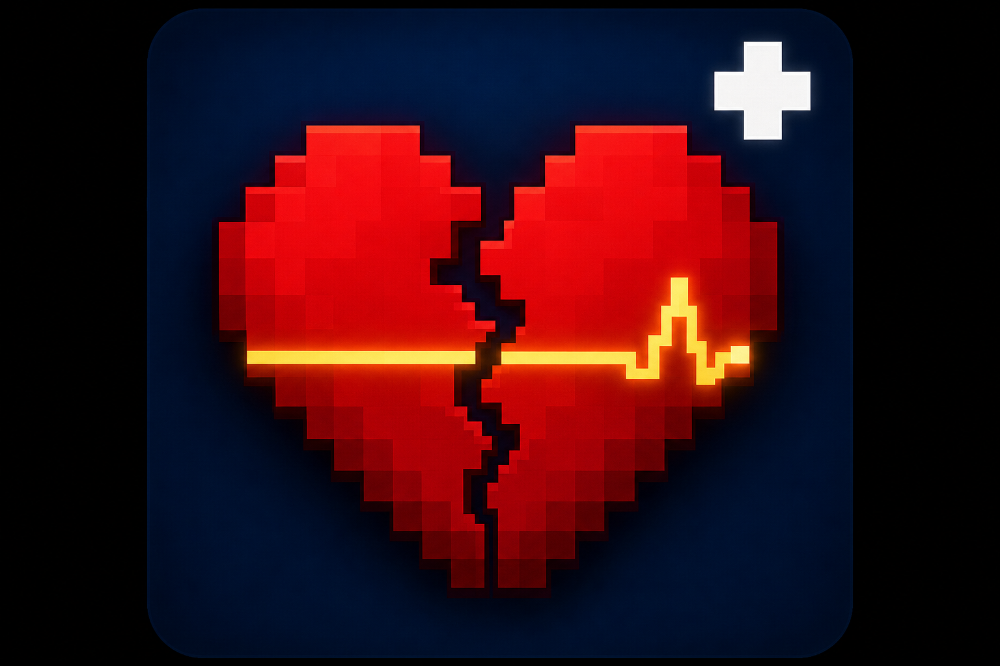

# Still-Breathing



**Turn lethal hits into a tense downed state — not instant death.**

When fatal damage would kill you, you collapse with 1 HP and start bleeding out. Allies can save you, enemies can finish you, and anyone nearby can take your gear before time runs out.

[](https://modrinth.com/mod/still-breathing)
[](LICENSE)

## Features

- **Downed state** — fatal damage is cancelled; you lie on the ground with a bleed-out timer
- **Self-revive** — hold **Sneak** to struggle back up (failure means death)
- **Ally revive** — hold **Shift + Right-click** on a downed player
- **Finish off** — enemies need repeated melee hits to kill a downed target
- **Looting** — open a downed player's inventory while they are knocked out
- **Give up** — accept death from the on-screen button
- **Recovery debuffs** — low health, Weakness, Slowness, and a grace period after waking up
- **Exhaustion stacks** — repeated knockouts make solo recovery harder
- **Animations** — lying-down pose powered by GeckoLib
- **Test dummies** — admin commands for testing without players
- **Configurable** — all core values are server-side settings

## Controls

| Action | Input |
|---|---|
| Try to get up | Hold **Sneak** |
| Revive ally | Hold **Shift + RMB** on downed player |
| Loot downed player | **RMB** on downed player |
| Give up | On-screen button |

## Requirements

| Mod | Version | Required |
|---|---|---|
| Minecraft | 1.20.1 | Yes |
| Forge | 47+ | Yes |
| [GeckoLib](https://modrinth.com/mod/geckolib) | 4.4+ | Yes |
| [Epic Fight](https://modrinth.com/mod/epic-fight) | 20.13+ | No (client) |

## Installation

1. Install **Forge 1.20.1** (47.4.20 or newer recommended).
2. Download **GeckoLib** for Forge 1.20.1 and place it in your `mods` folder.
3. Download the latest **Still-Breathing** `.jar` from [Modrinth](https://modrinth.com/mod/still-breathing) or [GitHub Releases](https://github.com/krendel001/Still-Breathing/releases).
4. Place `knockoutmod-*.jar` in your `mods` folder.
5. *(Optional)* Install Epic Fight on the client for animation compatibility.

### Server setup

Install the mod on the **server** and on every **client**. GeckoLib is required on both sides.

## Building from source

```bash
git clone https://github.com/krendel001/Still-Breathing.git
cd Still-Breathing
./gradlew build
```

On Windows:

```bat
gradlew.bat build
```

The reobfuscated mod jar is located at:

```
build/libs/knockoutmod-<version>.jar
```

Requirements: **Java 17**.

## Configuration

Server config file: `world/serverconfig/knockoutmod-server.toml`

| Setting | Default | Description |
|---|---|---|
| `bleedOutSeconds` | 90 | Time before unattended bleed-out |
| `allyReviveHoldSeconds` | 7 | Hold time for ally revive |
| `selfReviveHoldSeconds` | 8 | Hold time for active self-revive |
| `activeSelfReviveChance` | 0.05 | Success chance after holding Sneak |
| `finishHitsRequired` | 4 | Melee hits to finish a downed player |
| `recoveryHealthHearts` | 4 | Health after waking up |
| `knockoutGraceSeconds` | 18 | Grace period after recovery |
| `allowHotbarLoot` | true | Allow looting the hotbar |

## Admin commands

Requires permission level 2.

```
/knockout self              — knock yourself out (testing)
/knockout wake              — force wake yourself
/knockout dummy spawn [count] [name]
/knockout dummy remove
/knockout dummy removeall
/knockout dummy list
/knockout dummy knockout
/knockout dummy wake
/knockout dummy hitme
/knockout dummy hit <player>
```
## License

This project is licensed under the [MIT License](LICENSE).

## Credits

- Author: **krendel001**
- Animations: [GeckoLib](https://github.com/bernie-g/geckolib)
